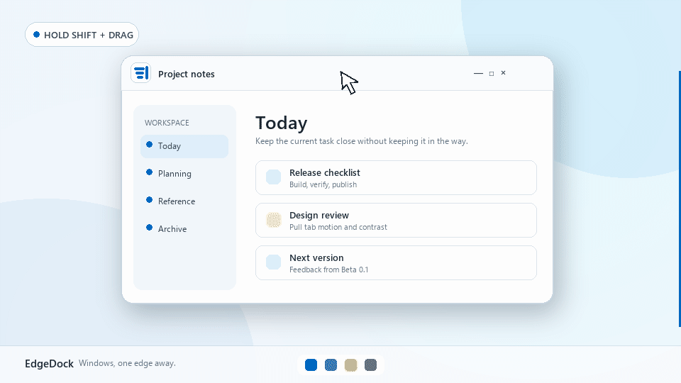

# EdgeDock

**Lightweight, native, and takes up virtually 0% CPU while idle.**

EdgeDock is a native C# / WPF Windows utility that moves ordinary app windows beyond a screen edge and leaves a compact pull tab behind. Hover to peek. Click to restore. Stack related windows when one tab is not enough.

[Download EdgeDock Beta 0.1](https://github.com/lol40560/EdgeDock-Website/releases/tag/v0.1.0-beta) | [Open the website](https://lol40560.github.io/EdgeDock-Website/index.html) | [Sponsor EdgeDock](https://github.com/sponsors/lol40560)

## Native by design

- **No Electron or embedded Chromium.** The control center is C# / WPF.
- **Low-overhead pull tabs.** The default renderer uses compact Win32/GDI overlays.
- **Idle means idle.** EdgeDock typically settles at virtually 0% CPU when nothing is moving.
- **Local-first.** Settings, rules, workspaces, and recovery data stay on your PC.
- **No runtime setup.** The standalone Windows download includes the required .NET runtime.

## How it works

1. Hold the docking modifier and drag a window to any monitor edge.
2. Release to park it beyond the screen, leaving a small pull tab.
3. Hover the tab to peek, click to restore, or double-click a stack to open Window Shuffle.

## Included in Beta 0.1

- Edge docking on every monitor side
- Smooth pull-tab peek and restore
- Stackable windows with live DWM previews
- Named workspaces and per-application docking rules
- Keyboard quick switcher and stack cycling
- Crash-safe position journal and emergency recovery
- Custom pull-tab colors, accessibility options, and reduced motion

## Download

Download the self-contained Windows x64 ZIP from [GitHub Releases](https://github.com/lol40560/EdgeDock-Website/releases/tag/v0.1.0-beta), unzip it, and run `EdgeDock.exe`. Cloning this repository is not required.

EdgeDock Beta 0.1 is currently unsigned, so Windows SmartScreen may display a warning. Save important work before testing beta software.

## Support the project

If EdgeDock improves your desktop workflow, [support development through GitHub Sponsors](https://github.com/sponsors/lol40560).

This repository hosts the public launch site and release downloads. The application source remains private during the beta.
